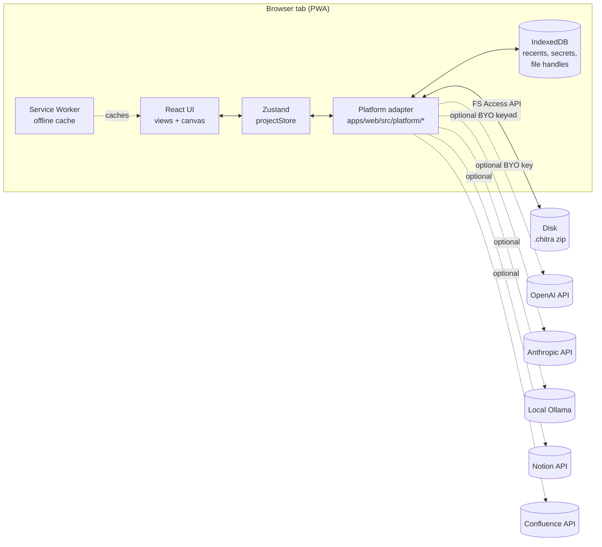
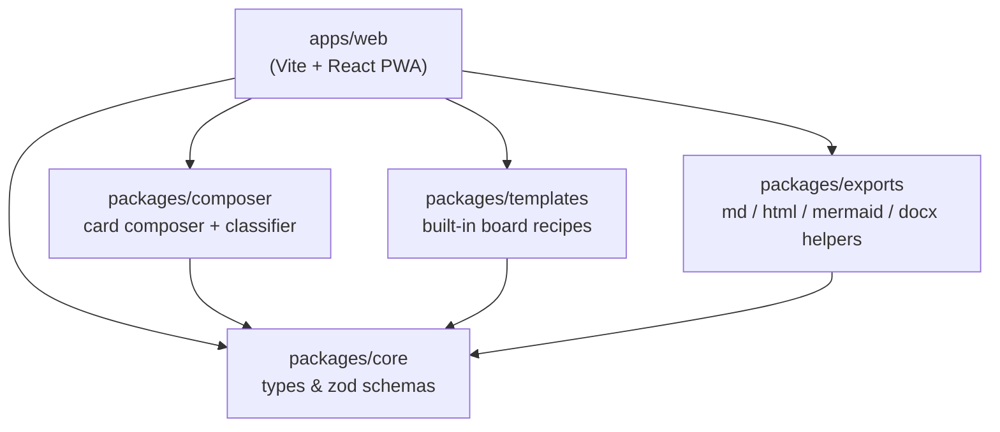
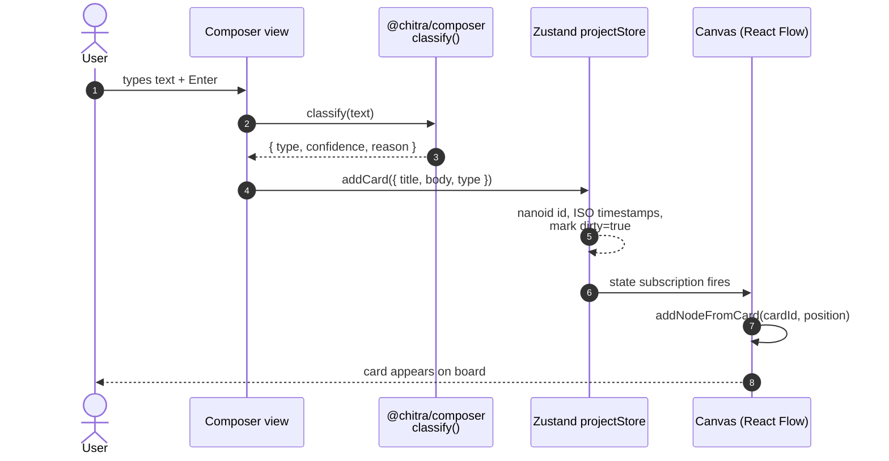
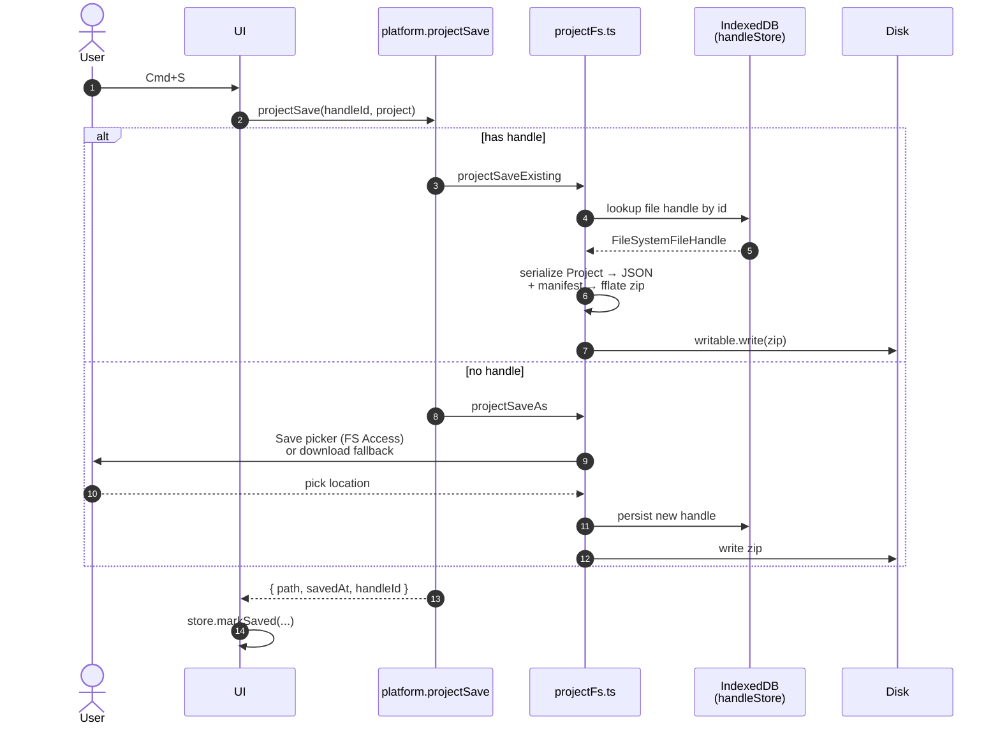

# 3. Architecture

## 3.1 High-level system view

Chitra is a **single-page PWA**. The entire application — UI, state,
persistence, exports, AI calls — runs inside the user's browser tab.
There is no Chitra server.



Key invariant: **every dotted edge is opt-in**. A user who never opens
Settings sees zero outbound network traffic after the initial PWA load.

## 3.2 Monorepo layout



`packages/core` is the **single source of truth** for the data model.
Every other package imports its types from there; nothing imports
"upward" toward `apps/web`.

## 3.3 Web app internal structure

```
apps/web/src/
├── App.tsx                  ← Root: routes between Welcome / Workspace / Onboarding
├── main.tsx                 ← Vite entry; mounts <App />
├── views/                   ← Top-level screens
│   ├── Welcome.tsx          ← Landing / recents / new project
│   ├── Workspace.tsx        ← The studio (canvas + side panels)
│   ├── Composer.tsx         ← Writing pane → typed card
│   ├── CardInspector.tsx    ← Per-card style & metadata editor
│   ├── DecisionLog.tsx      ← Filtered view of "decision" cards
│   ├── ExportMenu.tsx       ← Export dispatcher
│   ├── Inbox.tsx            ← Pasted/imported cards awaiting placement
│   ├── Onboarding.tsx       ← First-run tour
│   ├── Settings.tsx         ← AI keys, theme, recents
│   ├── Templates.tsx        ← Pick a template → seed a board
│   └── ThemeStudio.tsx      ← Palette / font / background editor
├── canvas/                  ← React Flow integration
│   ├── Canvas.tsx           ← Main canvas; nodes, edges, selection
│   ├── CardNode.tsx         ← React Flow node renderer for a Card
│   ├── FrameNode.tsx        ← Container/frame nodes
│   ├── ChitraEdge.tsx       ← Custom edge w/ labels & descriptions
│   ├── autoLayout.ts        ← dagre-driven layout
│   ├── snapEngine.ts        ← Snapping & alignment guides
│   ├── routeAvoid.ts        ← Path routing that avoids node bodies
│   ├── SketchOverlay.tsx    ← Excalidraw layer (lazy)
│   ├── BackgroundPanel.tsx  ← Per-board background editor
│   └── …
├── composer/                ← Writing → cards
│   ├── composeMarkdown.ts
│   ├── aiCompose.ts         ← Optional LLM enhancement
│   └── explainDiagram.ts    ← "Explain this board" → text
├── exports/                 ← Output adapters
│   ├── runExport.ts         ← exportMarkdown / exportPdf / exportPng / …
│   ├── docxBuilder.ts
│   └── importTable.ts
├── platform/                ← Browser-side capabilities
│   ├── projectFs.ts         ← New / Open / Save / SaveAs (.chitra)
│   ├── handleStore.ts       ← Persisted FS Access handles in IDB
│   ├── recents.ts
│   ├── settings.ts
│   ├── secrets.ts           ← Encrypted at-rest storage for AI keys
│   ├── menu.ts              ← In-app command bus
│   ├── fileSave.ts          ← Save-with-fallback helper
│   ├── exportPdf.ts         ← Browser print → PDF
│   ├── ai/                  ← openai.ts | anthropic.ts | ollama.ts
│   └── publish/             ← notion.ts | confluence.ts
├── state/
│   ├── projectStore.ts      ← Zustand store (the entire app state)
│   ├── paletteEngine.ts     ← Applies palette tokens to :root
│   ├── theme.ts
│   └── mode.ts
├── components/              ← Cross-cutting UI: CommandPalette, PassphrasePrompt
├── hooks/useHotkeys.ts
├── samples/sampleProject.ts
└── brand/Logo.tsx
```

## 3.4 Data flow — write a card to canvas



## 3.5 Persistence flow — save project



## 3.6 The `.chitra` archive format

A `.chitra` file is a plain zip produced by `fflate`:

```
my-plan.chitra (zip)
├── manifest.json     ← { app: "chitra", schemaVersion, appVersion, … }
├── project.json      ← The full Project (cards, boards, palettes, theme)
└── (future: assets/, attachments/, …)
```

Validated against `ProjectManifest` and `Project` zod schemas in
[`packages/core/src/schemas.ts`](../packages/core/src/schemas.ts) on every
open. Schema mismatches are reported with a precise zod path so the user
knows which field broke.
