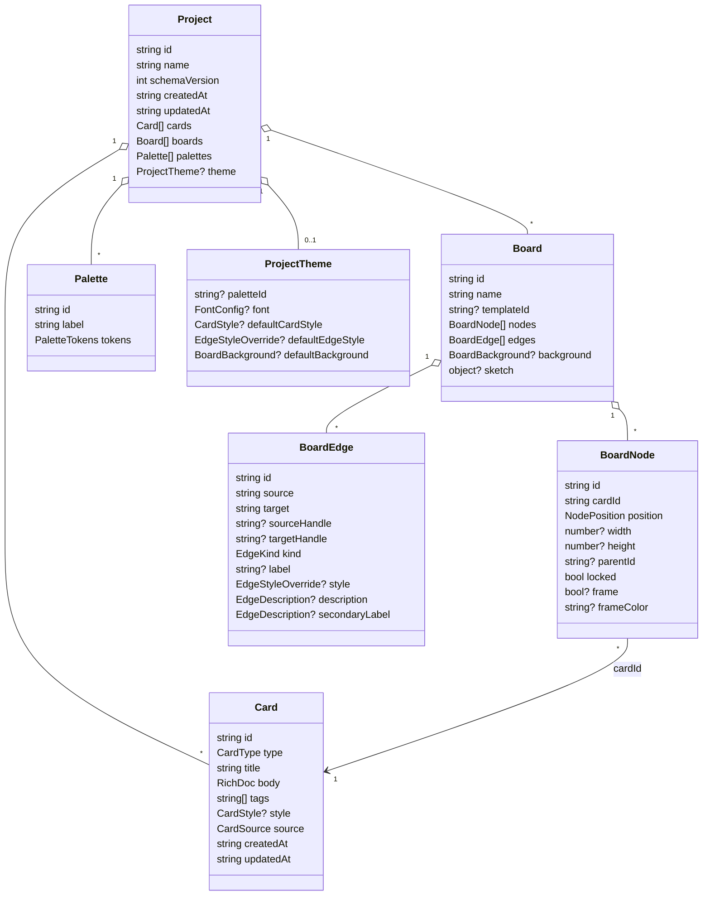

# 7. Data Model

All schemas are declared once in
[`packages/core/src/schemas.ts`](../packages/core/src/schemas.ts) using
**zod**, then `z.infer`'d into TypeScript types. The same schemas
validate `.chitra` files on open, so the contract is enforced at every
boundary.

## 7.1 Entity diagram



## 7.2 Enumerations

| Enum | Members |
|---|---|
| `CardType` | `goal`, `component`, `persona`, `metric`, `risk`, `step`, `note`, `decision`, `data` |
| `CardSource` | `typed`, `pasted`, `imported` |
| `CardBorderStyle` | `solid`, `dashed`, `dotted`, `none` |
| `CardShadowPreset` | `none`, `soft`, `lift`, `pop` |
| `EdgeKind` | `straight`, `depends-on`, `sequence`, `contains`, `conflicts-with`, `informs`, `flows-to` |
| `EdgeShape` | `straight`, `smoothstep`, `step`, `bezier`, `avoid` |
| `EdgeDash` | `solid`, `dashed`, `dotted` |
| `EdgeLabelPlacement` | `above`, `center`, `below` |
| `BackgroundKind` | `studio`, `solid`, `dots`, `grid`, `lines`, `iso`, `gradient`, `image` |
| `FontSource` | `system`, `bundled`, `google` |

## 7.3 The `.chitra` archive

A zip produced by `fflate`:

```
my-plan.chitra
├── manifest.json   ← ProjectManifest { app, schemaVersion, appVersion, … }
└── project.json    ← Project (validated by zod on open)
```

`PROJECT_SCHEMA_VERSION` is `1`. Versioned migration is intentionally
deferred until v2 — opening a future file with a higher schemaVersion
than the current build supports surfaces a clear error.

## 7.4 In-browser persistence

| Store | Backed by | Holds |
|---|---|---|
| `recents` | IndexedDB | last-opened projects + handle ids + thumbnails |
| `handleStore` | IndexedDB | `FileSystemFileHandle` per `handleId` |
| `settings` | IndexedDB | preferences (provider, palette default, etc.) |
| `secrets` | IndexedDB (encrypted) | AI keys, publish tokens — unlocked by passphrase |
| service-worker caches | Cache API | shipped JS/CSS/HTML/fonts/Excalidraw vendor chunks |
